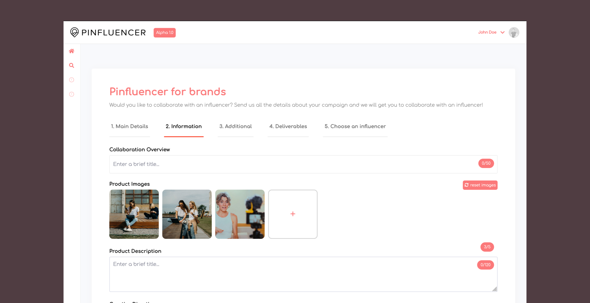
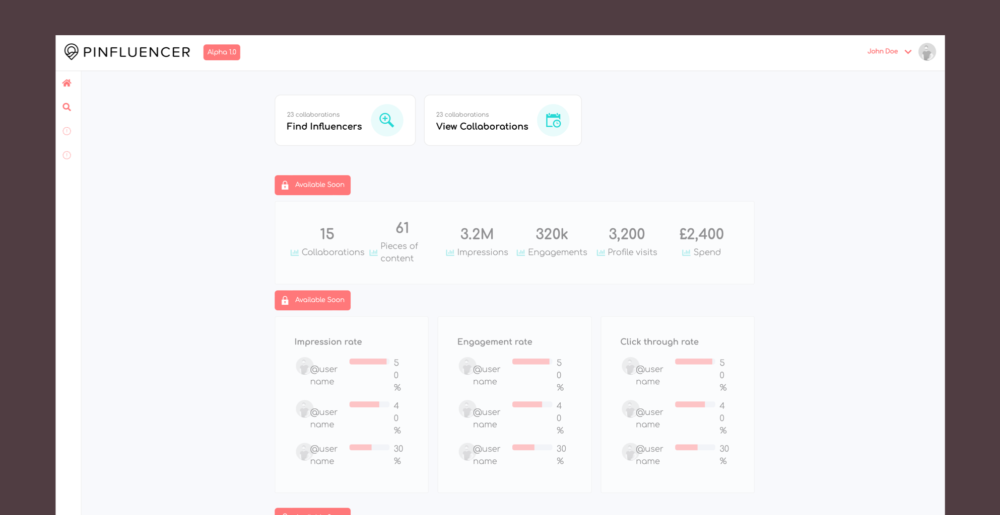
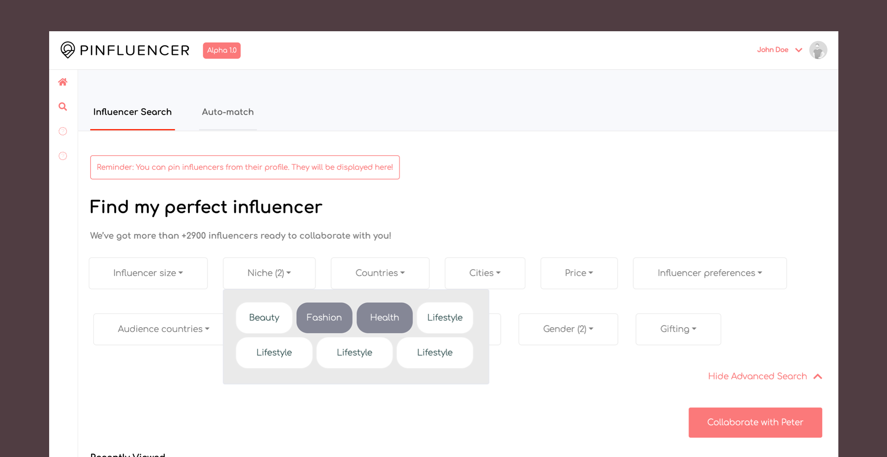
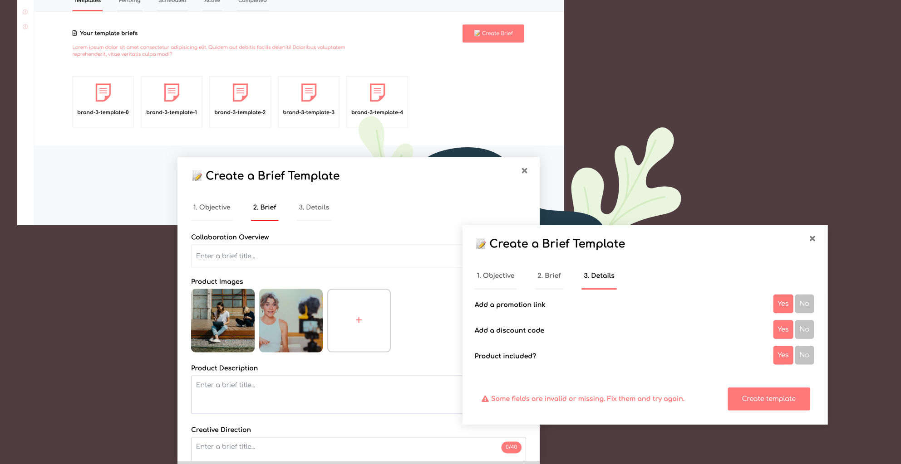
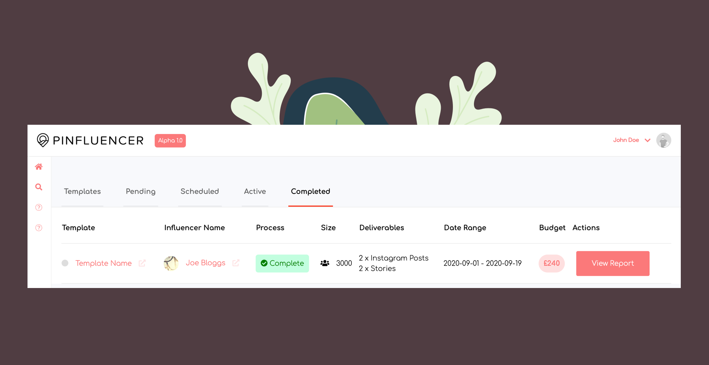
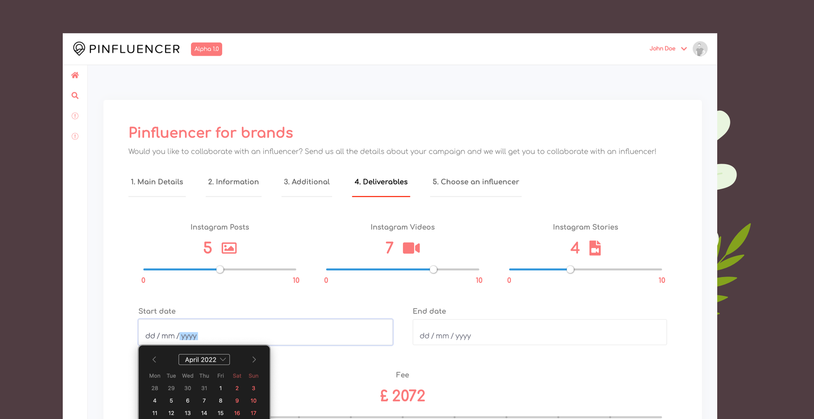
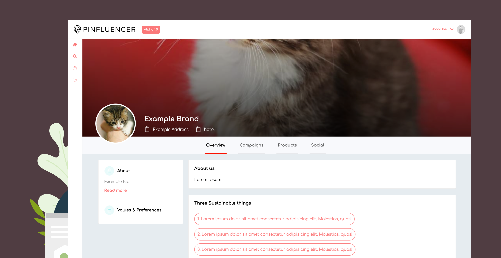
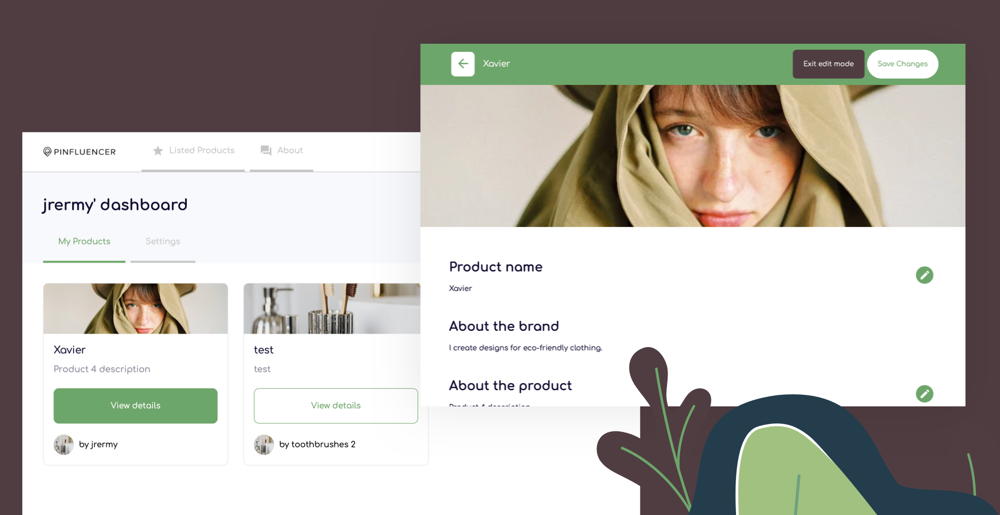
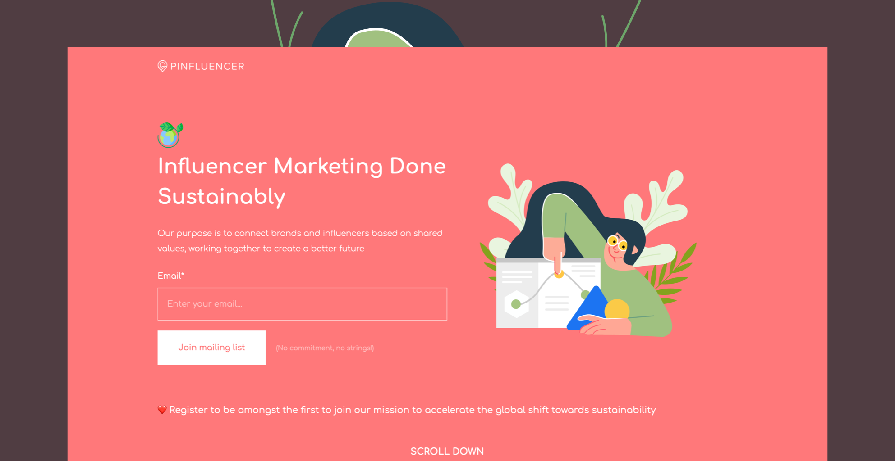

Pinfluencer is an influencer marketing platform that connects sustainably-minded brands with influencers in order to facilitate collaborations that have a net positive impact. During my third year of University, I joined the Pinfluencer team as a Front-End Developer / Designer, being also one of the earliest team members. Always as a side-project, I helped developing Pinfluencer's visual interfaces for several product iterations - finally developing a Proof Of Concept which connected influencers with brands.

# Overview of the project

I worked on three different projects during my time at Pinfluencer: Pinfluencer Portal, Pinfluencer.io and Pinfluencer Brands.

## Pinfluencer Portal

Pinfluencer was the first product iteration, which I re-designed from the ground up and implemented using Vue.js, SASS and some Bootstrap elements. My main job was to hook up the interface to a Symfony (PHP) API developed by the back end team. The project did not end up being released as it was part of the first product iterations.



Portal was a Vue 2 + Symfony monorepo. I was part of the Front-End team, and became the sole front-end developer after a few weeks. I was in charge of the front-end planning and architecture, being able to freely choose the direction the product was going to take. In order to create a POC for a Dashboard-like profile, I worked with several packages:

```json
{
  "devDependencies": {
    "@fortawesome/fontawesome-free": "^5.13.0",
    "@symfony/webpack-encore": "^0.28.3",
    "bootstrap": "^4.4.1",
    "core-js": "^3.0.0",
    "node-sass": "^4.13.1",
    "popper.js": "^1.16.1",
    "regenerator-runtime": "^0.13.2",
    "sass-loader": "^7.0.1",
    "vue-concise-slider": "^3.4.4",
    "webpack-notifier": "^1.6.0"
  },
  "dependencies": {
    "@popperjs/core": "^2.2.0",
    "axios": "^0.19.2",
    "bootstrap-vue": "^2.15.0",
    "chart.js": "^2.9.3",
    "jquery": "^3.4.1",
    "vue": "^2.6.11",
    "vue-chartjs": "^3.5.0",
    "vue-content-loader": "^0.2.3",
    "vue-infinite-loading": "^2.4.5",
    "vue-infinite-scroll": "^2.0.2",
    "vue-loader": "^15.9.2",
    "vue-router": "^3.4.5",
    "vue-scroll-loader": "^2.2.0",
    "vue-simple-suggest": "^1.10.1",
    "vue-slider-component": "^3.2.2",
    "vue-styled-components": "^1.5.1",
    "vue-template-compiler": "^2.6.11",
    "vuelidate": "^0.7.5",
    "vueperslides": "^2.10.2"
  }
}
```

I primarily focused on the user-facing interface, built with Vue.js. The POC was going to be used by different brands which they could use to manage and upload different campaigns with products.

### Main Overview

The main overview screen displayed several stats from the API, in a very simple and clear manner. To communicate with the back-end, I decided to use Axios.



### Influencer Search

Brands needed to be able to filter through different influencers, in order to make the best choice when doing collaborations. An advanced search was implemented with several filtering categories, ranging from influencer size, niche, countries, etc.

```vue
<!-- Example of a component using vue-slider-component, which allows the user to select a range of different categories. -->
<template>
  <div
    class="light-padded-border white-bg"
    :style="{
      width: `${width}px`,
    }"
  >
    <div class="row">
      <small class="col-2 text-left"
        >{{ min }} <span v-if="minLabel">{{ minLabel }}</span></small
      >
      <h6 class="col-8 text-center">{{ headingName }}</h6>
      <small class="col-2 text-right"
        >{{ max }} <span v-if="maxLabel">{{ maxLabel }}</span></small
      >
    </div>

    <vue-slider
      v-model="range"
      :enable-cross="false"
      :min="min"
      :max="max"
      :interval="interval"
      hide-label
      @change="$emit('change', range)"
    />
  </div>
</template>
```



### Creating and managing campaigns

Portal's first goal was to allow brands to manage several campaigns, which could include several influencers. These campaigns, which were being loaded from the API, also included skeleton loaders to make improve the overall user experience. The creation of campaigns had three parts: Selecting the basic information of a campaign, which included text input and selection data points.

```vue
<!-- Example of an input component, which is an extension of the basic b-form-input and includes several features such as warning modes, max-lengths and a character counter -->
<template>
  <div :class="`PInput ${warningMode ? 'warning' : null}`">
    <b-container fluid>
      <label class="label" :for="`type-${type}`">{{ label }}</label>
      <div class="PInput__standard">
        <b-form-input
          v-if="type !== 'textarea'"
          b-form-input
          :id="`type-${type}`"
          :name="name"
          @change="el => sendData(el, type)"
          :maxlength="maxLength"
          @keyup="el => charCount(el)"
          :placeholder="placeholder"
          :type="type"
        ></b-form-input>
        <span v-if="addCounter" class="PInput__counter"
          >{{ totalcharacter }}/{{ maxLength }}</span
        >
      </div>
      <div v-if="type == 'textarea'" class="PInput__textarea">
        <textarea
          class="form-control"
          id="exampleFormControlTextarea1"
          :maxlength="maxLength"
          :name="name"
          @change="el => sendData(el, type)"
          :placeholder="placeholder"
          @keyup="el => charCount(el)"
          rows="3"
        ></textarea>
        <span class="PInput__counter"
          >{{ totalcharacter }}/{{ maxLength }}</span
        >
      </div>
    </b-container>
    <span v-show="warningMode" class="PInput__warningModeText"
      ><i style="margin-right: 5px" class="fas fa-exclamation-triangle"></i
      >{{ warningModeText }}</span
    >
  </div>
</template>
```



The second part of the campaign creation allowed users to upload several images to the campaign. A custom component was developed which also included an image counter and image previews.

```vue
<!-- Custom image uploader component -->
<template>
  <div class="wrapper">
    <label>{{ label }}</label>
    <span @click="resetImages"
      ><i style="margin-right: 5px" class="fas fa-sync-alt"></i>reset
      images</span
    >
    <div class="PImageUploader">
      <div
        class="PImageUploader__image"
        v-for="(item, index) in items"
        :key="index"
      >
        <div
          v-if="!item.image"
          @click="launchFilePicker"
          class="
            image-placeholder
            d-flex
            justify-content-center
            align-items-center
          "
        >
          <h1 class="mb-0 p-red">+</h1>
        </div>
        <div v-else>
          <div class="image">
            
          </div>
        </div>

        <input
          ref="file"
          type="file"
          style="display: none"
          @change="onFileChange(item, $event)"
        />
      </div>
    </div>
    <PCounter
      :count="uploadedImagesCount"
      :limit="5"
      :ok="uploadedImagesCount < 5"
      :breach="uploadedImagesCount === 5"
    />
  </div>
</template>

<script>
export default {
  data() {
    return {
      items: [
        {
          image: false,
        },
      ],
      files: [],
    }
  },
  props: ["label"],
  computed: {
    imageCounterTextClass() {
      if (this.items.length === 5) return "text-danger"

      return ""
    },
    imageCounterText() {
      return `${this.items.filter(item => item.image).length} / 5`
    },
    uploadedImagesCount() {
      return this.items.filter(item => item.image).length
    },
  },
  methods: {
    launchFilePicker() {
      this.$refs.file[0].click()
    },
    onFileChange(item, e) {
      const files = e.target.files || e.dataTransfer.files
      if (!files.length) return
      this.createImage(item, files[0])
    },
    createImage(item, file) {
      const image = new Image()
      const reader = new FileReader()

      const index = this.items.findIndex(item => !item.image)

      reader.onload = e => {
        this.items[index].image = e.target.result
      }
      reader.readAsDataURL(file)

      this.files.push({ image: file })

      this.$emit("image-uploaded", this.files)
      if (this.items.length < 5) {
        this.items.push({ image: false })
      }
    },
    resetImages() {
      this.items = [{ image: false }]
      this.files = []
    },
    removeImage: function (item) {
      item.image = false
    },
  },
}
</script>

<style lang="scss" scoped>
@import "./assets/css/main.scss";

label {
  font-weight: 700;
}
.wrapper {
  position: relative;

  span {
    position: absolute;
    right: 0;
    background: #ff797a;
    color: white;
    cursor: pointer;
    padding: 5px;
    border-radius: 5px;
    font-size: 11px !important;
  }
}

.PImageUploader {
  display: flex;
  align-items: center;
  justify-content: flex-start;

  &__image {
    display: inline-block;
    margin-right: 10px !important;

    .image-placeholder {
      height: 140px;
      width: 140px;
      background-color: white;
      border: solid 2px lightgray;
      border-radius: 10px;
      cursor: pointer;
    }

    .image,
    .image > img {
      height: 140px;
      width: 140px;
      object-fit: cover;
      border-radius: 10px;
    }
  }
}
</style>
```

Besides basic text input and image loading, another custom list component was developed from the ground up, which allowed the user to add different Do's and Dont's for a particular campaign.

```vue
<!-- Custom list input component -->
<template>
  <div class="PDosDonts">
    <div class="PDosDonts__Block">
      <h3>Do's</h3>
      <div class="PDosDonts__content">
        <ul class="list-unstyled">
          <li v-if="dos.length == 0" class="PDosDonts__noItems">
            Add your first item!
          </li>
          <li :key="item" v-for="(item, ind) in dos">
            <label>
              <p
                class="PDosDonts__closeIcon"
                @click="() => removeItem(ind, 'dos')"
              >
                <span>x</span>
              </p>
              <span v-bind:class="{ done: item.done }">{{ item.text }}</span>
            </label>
          </li>
        </ul>
        <p>
          <input
            class="PDosDonts__input"
            type="text"
            v-model="doText"
            placeholder="+ add new todo here"
          />
          <a v-on:click="addDo()" class="btn btn-primary btn-sm">+</a>
        </p>
      </div>
    </div>
    <div class="PDosDonts__Block">
      <h3>Dont's</h3>
      <div class="PDosDonts__content">
        <ul class="list-unstyled">
          <li v-if="donts.length == 0" class="PDosDonts__noItems">
            Add your first item!
          </li>
          <li :key="item" v-for="item in donts">
            <label>
              <p
                class="PDosDonts__closeIcon"
                @click="() => removeItem(ind, 'donts')"
              >
                <span>x</span>
              </p>
              <span v-bind:class="{ done: item.done }">{{ item.text }}</span>
            </label>
          </li>
        </ul>
        <p>
          <input
            class="PDosDonts__input"
            type="text"
            v-model="dontText"
            placeholder="add new todo here"
          />
          <a v-on:click="addDont()" class="btn btn-primary btn-sm">+</a>
        </p>
      </div>
    </div>
  </div>
</template>

<script>
export default {
  data() {
    return {
      doText: "",
      dontText: "",
      dos: [],
      donts: [],
    }
  },
  methods: {
    addDo: function () {
      var newDo = this.doText.trim()
      if (!newDo) {
        return
      }
      this.dos.push({ text: newDo, done: false })
      this.doText = ""
      this.$emit("getDosDonts", { dos: this.dos, donts: this.donts })
    },
    addDont: function () {
      var newDont = this.dontText.trim()
      if (!newDont) {
        return
      }
      this.donts.push({ text: newDont, done: false })
      this.dontText = ""
      this.$emit("getDosDonts", { dos: this.dos, donts: this.donts })
    },
    removeItem: function (el, type) {
      if (type == "dos") {
        this.dos.splice(el, 1)
      } else if (type == "donts") {
        this.donts.splice(el, 1)
      }

      this.$emit("getDosDonts", { dos: this.dos, donts: this.donts })
    },
  },
}
</script>
```

All campaign-related features were part of a global `<form />` component, which included validation throughout the campaign creation process to make sure the user wasn't missing any key data. Campaigns could be viewed in two different ways: through unstructured visual blocks and as a table. Using HTML's base `<table />` component, a more tailored vue table component was created which included internal in-app links, status banners, date ranges and dynamic reports.



```vue
<template>
  <div>
    <table class="table-1">
      <tr>
        <th v-for="(header, ind) in headers" :key="ind">
          {{ header }}
        </th>
        <th>Actions</th>
      </tr>
      <tr v-for="(el, ind) in data" :key="ind">
        <td v-if="el.template" class="template">
          <a :href="el.template.link" target="_blank">
            <i
              class="fa fa-circle"
              style="color: #dddddd"
              aria-hidden="true"
            ></i>
            <span>{{ el.template.title }}</span>
            <i
              style="opacity: 0.2; margin-left: 10px"
              class="fas fa-external-link-alt"
            ></i>
          </a>
        </td>
        <td v-if="el.influencer" class="influencer">
          <a :href="el.influencer.link" target="_blank">
            
            <span
              >{{ el.influencer.name.first }}
              {{ el.influencer.name.last }}</span
            >
            <i
              style="opacity: 0.2; margin-left: 10px"
              class="fas fa-external-link-alt"
            ></i>
          </a>
        </td>
        <td v-if="el.process" class="process">
          <span :class="`status-tag ${el.process.id}`">
            <i
              v-if="el.process.id == 'complete'"
              class="fas fa-check-circle"
            ></i>
            {{ el.process.displayName }}
          </span>
        </td>

        <td v-if="el.size" class="size">
          <i style="margin-right: 10px" class="fas fa-users"></i>
          <span>{{ el.size.count }}</span>
        </td>

        <td v-if="el.deliverables" class="deliverables">
          <span v-for="(deliverable, ind) in el.deliverables" :key="ind">
            {{ deliverable.amount }} x
            {{ deliverable.displayName }}
          </span>
        </td>

        <td v-if="el.dateRange" class="date-range">
          <span>
            {{ el.dateRange.start.substring(0, 10) }} -
            {{ el.dateRange.end.substring(0, 10) }}
          </span>
        </td>

        <td v-if="el.budget" class="budget">
          <span>
            {{ el.budget }}
          </span>
        </td>

        <td>
          <div class="actions">
            <a
              v-if="el.process.id !== 'complete'"
              class="PTable__button"
              :href="`/collaboration/${el.id}`"
              target="_blank"
            >
              <i class="fas fa-eye"></i>
            </a>
            <a
              v-if="el.process.id == 'complete'"
              :href="`/collaboration/${el.id}/report/`"
              target="_blank"
            >
              <PButton body="View Report" type="btn-primary" />
            </a>
          </div>
        </td>
      </tr>
    </table>
    <div class="PTable__empty" v-show="isTableEmpty">No results</div>
  </div>
</template>
```



### User Profiles

Both brands and influencers needed to have their own dynamically-created and editable profiles, which would be rendered through URL id's. Profiles included descriptions, lists, images, addresses, videos, external links such as Instagram videos, etc.



## Pinfluencer Brands

Pinfluencer Brands was another iteration of the previous POC, which stripped out most of the complex features and only focused on the brand-influencer relationship. Futhermore, a different tech stack was used to develop it, this time going for React in the front-end with AWS Amplify being used in the back-end. As with Portal, I was fully in-charge of designing and developing the client interface.



This setup improved many aspects of the previous workflow, such as adding React Redux for state management, user authentication with AWS and JWTs, styled-components for CSS styling, among other tools and frameworks:

```json
  "dependencies": {
    "@aws-amplify/ui-react": "^1.2.17",
    "@reduxjs/toolkit": "^1.6.1",
    "@testing-library/jest-dom": "^5.11.4",
    "@testing-library/react": "^11.1.0",
    "@testing-library/user-event": "^12.1.10",
    "amazon-cognito-identity-js": "^5.1.1",
    "aws-amplify": "^4.2.11",
    "aws-amplify-react": "^5.1.0",
    "axios": "^0.21.4",
    "babel-eslint": "^10.1.0",
    "eslint-config-airbnb": "^18.2.1",
    "eslint-config-prettier": "^8.3.0",
    "eslint-plugin-import": "^2.25.2",
    "eslint-plugin-jsx-a11y": "^6.4.1",
    "eslint-plugin-prettier": "^4.0.0",
    "eslint-plugin-react": "^7.25.3",
    "formik": "^2.2.9",
    "jwt-decode": "^3.1.2",
    "material-design-icons": "^3.0.1",
    "react": "^17.0.2",
    "react-breadcrumbs-dynamic": "^1.2.1",
    "react-content-loader": "^6.0.3",
    "react-dom": "^17.0.2",
    "react-icons": "^4.2.0",
    "react-images-upload": "^1.2.8",
    "react-redux": "^7.2.5",
    "react-router": "^5.2.1",
    "react-router-dom": "^5.3.0",
    "react-scripts": "4.0.3",
    "react-through": "^1.1.4",
    "react-toastify": "^8.0.3",
    "simple-icons": "^5.16.0",
    "styled-components": "^5.3.1",
    "uuid": "^8.3.2",
    "web-vitals": "^1.0.1",
    "yup": "^0.32.9"
  },
```

Authentication was handled via AWS Cognito, through a JWT token that was then stored in the main state through Redux's toolkit. Token decodification was necessary to validate if the user had completed their profile, and to get several data points required to run the app.

```js
// Main auth reducer used to authenticate the user when accessing the app.

import jwt_decode from "jwt-decode"
import { createAsyncThunk, createSlice } from "@reduxjs/toolkit"
import { getBrandInfo } from "../../services/resources"

export const getTokenFromStorage = createAsyncThunk(
  "getTokenFromStorage",
  async () => {
    const token = await localStorage.getItem("@pinfluencer-auth")
    const hasCompletedProfile = await getBrandInfo()
    const decodedToken = jwt_decode(token)

    // If the token has an email, then decode it and include it in the response.
    if (token) {
      return { token, hasCompletedProfile, decodedEmail: decodedToken?.email }
    }
    return { token, hasCompletedProfile }
  }
)

export const authenticationSlice = createSlice({
  name: "authentication",
  initialState: {
    // User token
    token: null,
    // Returns true if user is authenticated
    isUserAuthenticated: null,
    // Returns true if user has a brand
    hasCompletedProfile: true,
    // Returns the user's brand
    brand: null,
    // If token includes an email, store it in state
    decodedEmail: null,
    // Returns brand image
    brandImage: null,
  },
  reducers: {
    logOut: state => {
      state.token = null
      state.isUserAuthenticated = false
      localStorage.removeItem("@pinfluencer-auth")
    },
    setCompletedProfile: (state, { payload }) => {
      state.hasCompletedProfile = payload
    },
    setImage: (state, { payload }) => {
      state.brandImage = payload
      console.log("changing from reducer", payload)
    },
  },
  extraReducers: {
    // Add reducers for additional action types here, and handle loading state as neede
    [getTokenFromStorage.fulfilled]: (state, { payload }) => {
      // If there is no token, then user is not authenticated
      if (payload.token === null) {
        state.isUserAuthenticated = false
        return
      }

      // if there is a token, then user gets authenticated
      state.isUserAuthenticated = true
      state.token = payload.token

      // Check for email in token
      if (payload.decodedEmail) {
        state.decodedEmail = payload.decodedEmail
      }

      // check if user is authenticated (e.g. token expired)
      if (payload.hasCompletedProfile === 401) {
        state.hasCompletedProfile = false
        console.log("EXPIRED", payload.hasCompletedProfile)
        return
      }

      // check for completed profile
      if (
        payload.hasCompletedProfile === 404 ||
        payload.hasCompletedProfile === []
      ) {
        state.hasCompletedProfile = false
        return
      }

      state.brand = payload.hasCompletedProfile
      state.brandImage = `https://pinfluencer-product-images.s3.eu-west-2.amazonaws.com/${payload.hasCompletedProfile.id}/image`

      state.hasCompletedProfile = true
      console.log("my brand", state.brand)
    },
  },
})

// Action creators are generated for each case reducer function
export const {
  logOut,
  setCompletedProfile,
  setImage,
} = authenticationSlice.actions

export default authenticationSlice.reducer
```

In order to implement a user-friendly and accessibility-focused app, `formik` was used, allowing us to create fully-custom input components with advanced verification systems and other features.

```jsx
// Extract of the Formik component used to create more custom text fields
<Wrapper>
  <Formik
    enableReinitialize
    validationSchema={FormSchema}
    initialValues={values}
    onSubmit={async (getFormValues, { setSubmitting }) => {
      setSubmitting(true)
      await submitForm(getFormValues)
      setSubmitting(false)
    }}
  >
    {({ isValid, isSubmitting, setFieldValue }) => (
      <Form>
        {props.editBrand ? (
          <DefaultImageSelector
            brandID={brand?.id}
            uploader={
              <ImageUploader
                label="Featured image"
                receiveFileName={el => {
                  setFieldValue("filename", el)
                }}
                receiveBase64={el => {
                  setFieldValue("bytes", el.split("base64,")[1])
                }}
              />
            }
          />
        ) : (
          <ImageUploader
            label="Featured image"
            receiveFileName={el => {
              setFieldValue("filename", el)
            }}
            receiveBase64={el => {
              setFieldValue("bytes", el.split("base64,")[1])
            }}
          />
        )}
        <TextField
          placeholder="Email"
          type="email"
          name="email"
          disabled={decodedEmail}
        />
        <TextField placeholder="Name" type="text" name="name" />
        <TextField
          placeholder="Business Description"
          type="text"
          name="description"
        />
        <TextField
          placeholder="Instagram handle"
          type="text"
          name="instahandle"
        />
        <TextField placeholder="Website" type="text" name="website" />
        {!props.editBrand ? <Logout text="Cancel" /> : null}
        <Button isDisabled={!isValid} type="submit">
          {isSubmitting
            ? "Loading..."
            : `${props.editBrand ? "Update brand" : "Create my brand"}`}
        </Button>
        {data ? <Error>{data}!</Error> : null}
      </Form>
    )}
  </Formik>
</Wrapper>
```

Products could be created and edited through an edit-mode interface, a system that was created from the ground up.

```jsx
// Extract of the single product component, which included the edit mode functionality
<Wrapper>
  <Header>
    <HeaderContents>
      <BackButton />
      <H3>{modifiedProduct?.name || "No name"}</H3>
      {renderButtons()}
    </HeaderContents>
  </Header>
  <ImageWrapper>
    {product ? (
      <Image src={getImage("product", product?.brand?.id, product?.id)} />
    ) : null}
    {editMode ? (
      <EditButton
        title="Name"
        type="name"
        position="top right"
        content={
          <EditImage
            type="name"
            getInitialValues={{ filename: "", bytes: "" }}
            getModifiedValues={modifyProduct}
          />
        }
      />
    ) : null}
  </ImageWrapper>
  <StandardLayout>
    <Text>
      <H1>Product name</H1>
      <P>{modifiedProduct?.name}</P>
      {editMode ? (
        <EditButton
          title="Name"
          type="name"
          position="top right"
          content={
            <EditSingleField
              type="name"
              getInitialValues={{ name: product?.name }}
              getModifiedValues={modifyProduct}
            />
          }
        />
      ) : null}
    </Text>
    <Text>
      <H1>About the brand</H1>
      <P>I create designs for eco-friendly clothing.</P>
    </Text>
    <Text>
      <H1>About the product</H1>
      <P>{modifiedProduct?.description || "No description"}</P>
      {editMode ? (
        <EditButton
          title="Description"
          type="name"
          position="top right"
          content={
            <EditSingleField
              type="description"
              getInitialValues={{ description: product?.description }}
              getModifiedValues={modifyProduct}
            />
          }
        />
      ) : null}
    </Text>
    <Text>
      <H1>Influencer requirements</H1>
      <InfluencerRequirements
        requirements={modifiedProduct?.requirements || "No requirements"}
      />
      {editMode ? (
        <EditButton
          title="Influencer Requirements"
          type="name"
          position="top right"
          content={
            <EditSingleField
              type="requirements"
              getInitialValues={{ requirements: product?.requirements }}
              getModifiedValues={modifyProduct}
            />
          }
        />
      ) : null}
    </Text>
    <Text>
      <H1>What you&apos;ll get</H1>
      <UnorderedList>
        <ListItem>🎁 Gifted product</ListItem>
      </UnorderedList>
    </Text>
  </StandardLayout>
</Wrapper>
```

## Pinfluencer's Landing page (Static version)



In order to promote Pinfluencer's products, the team decided to create a custom landing page. I was in charge of designing and implementing the site, which I decided to build using Gatsby.js and styled-components. A much more simple product compared to the previous two, but taking advantage of Gatsby's full potential with GraphQL, several plugins and custom seo:

```js
// Custom SEO component using react-helmet
function SEO({ description, lang, meta, keywords, title }) {
  return (
    <StaticQuery
      query={detailsQuery}
      render={data => {
        const metaDescription =
          description || data.site.siteMetadata.description
        return (
          <Helmet
            htmlAttributes={{
              lang,
            }}
            title={title}
            titleTemplate={`%s | ${data.site.siteMetadata.title}`}
            meta={[
              {
                name: `description`,
                content: metaDescription,
              },
              {
                property: `og:title`,
                content: title,
              },
              {
                property: `og:description`,
                content: metaDescription,
              },
              {
                property: `og:type`,
                content: `website`,
              },
              {
                name: `twitter:card`,
                content: `summary`,
              },
              {
                name: `twitter:creator`,
                content: data.site.siteMetadata.author,
              },
              {
                name: `twitter:title`,
                content: title,
              },
              {
                name: `twitter:description`,
                content: metaDescription,
              },
            ]
              .concat(
                keywords.length > 0
                  ? {
                      name: `keywords`,
                      content: keywords.join(`, `),
                    }
                  : []
              )
              .concat(meta)}
          />
        )
      }}
    />
  )
}

SEO.defaultProps = {
  lang: `en`,
  meta: [],
  keywords: [],
}

SEO.propTypes = {
  description: PropTypes.string,
  lang: PropTypes.string,
  meta: PropTypes.array,
  keywords: PropTypes.arrayOf(PropTypes.string),
  title: PropTypes.string.isRequired,
}

export default SEO

const detailsQuery = graphql`
  query DefaultSEOQuery {
    site {
      siteMetadata {
        title
        description
        author
      }
    }
  }
`
```