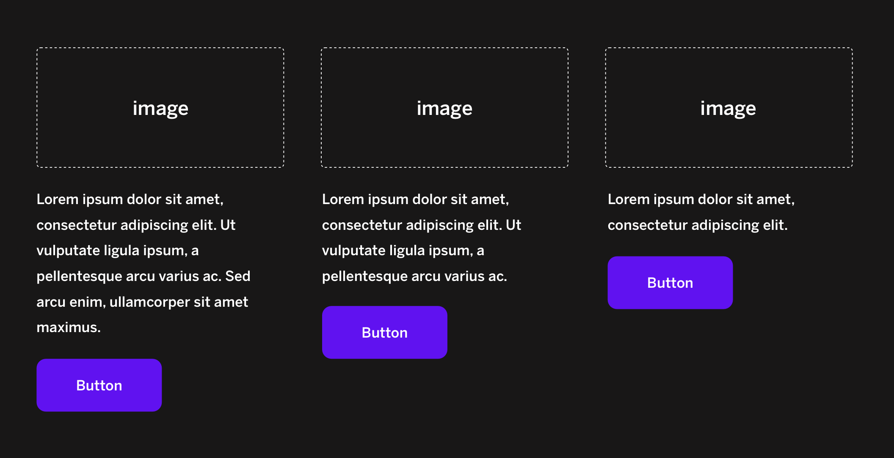
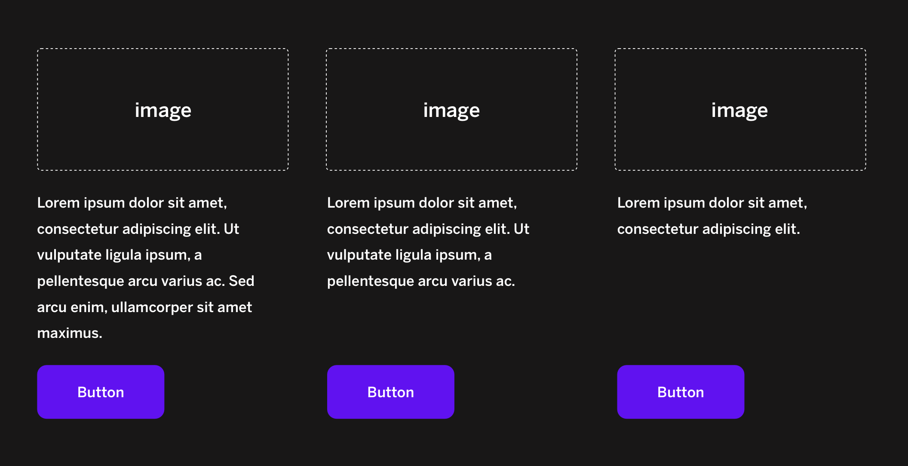

**Final code at the end of the page!**

I've recently come across a quick and cool trick to build dynamic card components that scale based on the item with more text. It's probably nothing too new, but found it so useful that I thought of sharing it. 

When building card components with an image, text and a button (i can't think of anything more common than this!), it's usual for the designer to ask for the bottom buttons to always be aligned. 

**Basically, we're trying to avoid this**:



We can't usually predict how much text a card component will have, but it is possible to use flex to make all items to be consistent, thanks to `justify-content: space-between;` and `align-items: space-between;`:

**Voilà!**:



```html
<div class="container">
  <div class="item">
    <div class="item__image"></div>
    <div class="item__text">Barely any text</div>
    <div class="item__button">button</div>
  </div>
  <div class="item">
    <div class="item__image"></div>
    <div class="item__text">Lorem ipsum dolor sit amet, consectetur adipiscing elit. Vivamus vulputate sed justo non lacinia. Cras tincidunt condimentum est. Etiam ac aliquam erat, quis euismod ex. Praesent semper ut neque at ultrices. Curabitur fringilla aliquam auctor. Curabitur hendrerit nunc eu ligula scelerisque pulvinar.</div>
    <div class="item__button">button</div>
  </div>
    <div class="item">
    <div class="item__image"></div>
    <div class="item__text">Lorem ipsum dolor sit amet, consectetur adipiscing elit. Vivamus vulputate sed justo non lacinia. Cras tincidunt condimentum est. Etiam ac aliquam erat, quis euismod ex. Praesent semper ut neque at ultrices. Curabitur fringilla aliquam auctor. Curabitur hendrerit nunc eu ligula scelerisque pulvinar. Nam bibendum quis odio nec gravida. Vivamus quis vestibulum dolor. Cras non dignissim risus, sit amet volutpat eros. Praesent congue malesuada sapien eget efficitur. Aenean dui elit, aliquet in pellentesque in, tempor eget ipsum. </div>
    <div class="item__button">button</div>
  </div>
</div>
```

I'll leave the SCSS code too:

```scss
.container {
  border: 1px solid red;
  display: grid; 
  grid-auto-columns: 1fr; 
  grid-template-columns: 1fr 1fr 1fr; 
  grid-template-rows: 1fr; 
  gap: 0px 0px; 
  max-width: 400px;
  margin: auto;
  
  .item {
    display: flex;
    flex-direction: column;
    border: 1px solid blue;
    justify-content: space-between;
    align-items: space-between;
    
    &__text {
      border: 1px solid green;
      height: 100%;
    }
  }
}
```

I've made a codepen too, if you'd like to check it out: [Codepen here](https://codepen.io/xavierbardaji/pen/RwjEwKR)

