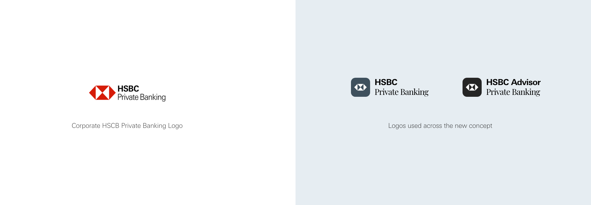
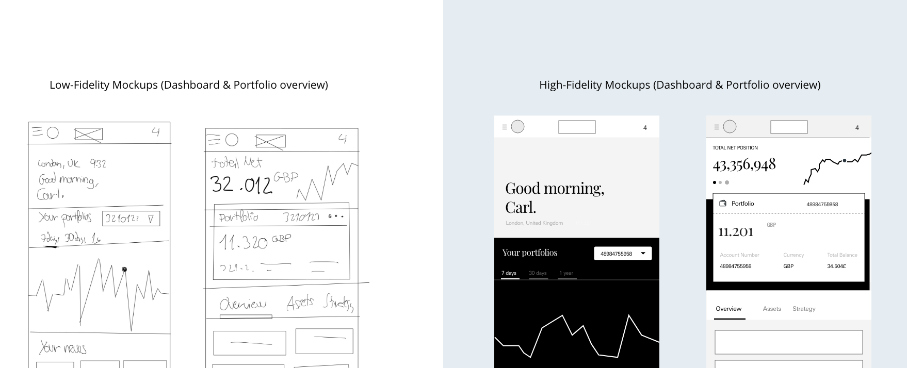
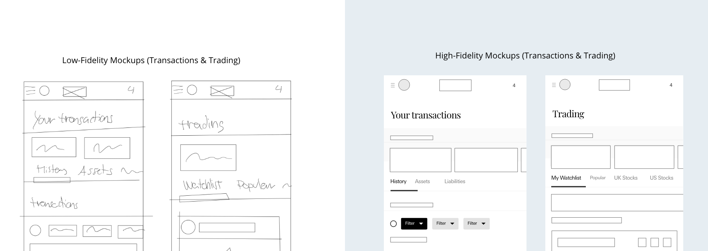
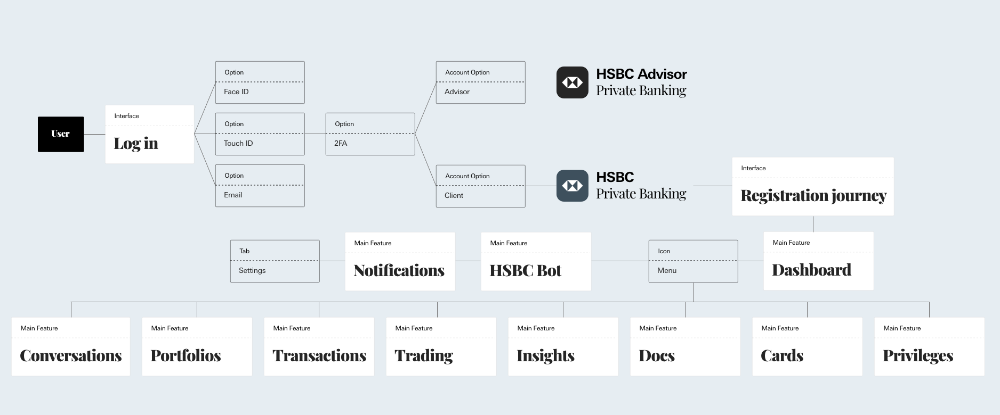
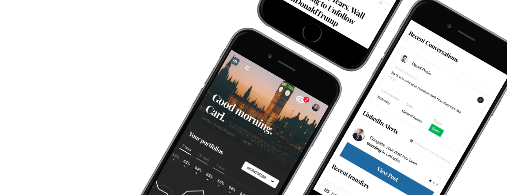
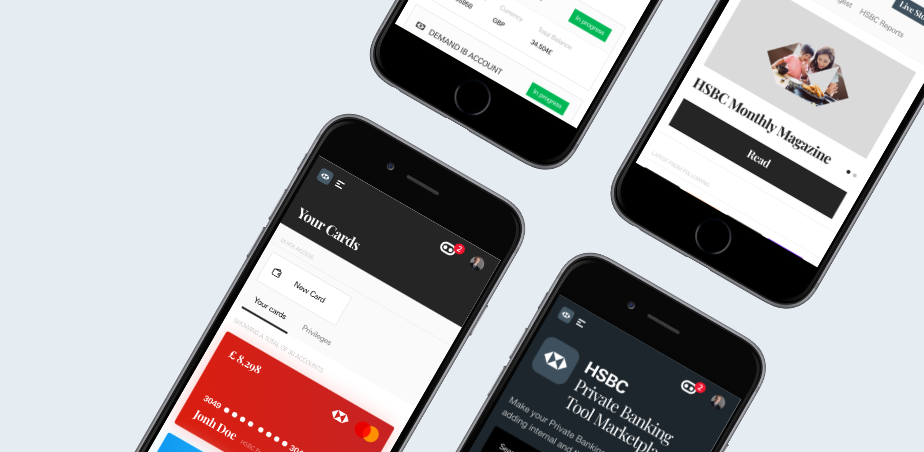
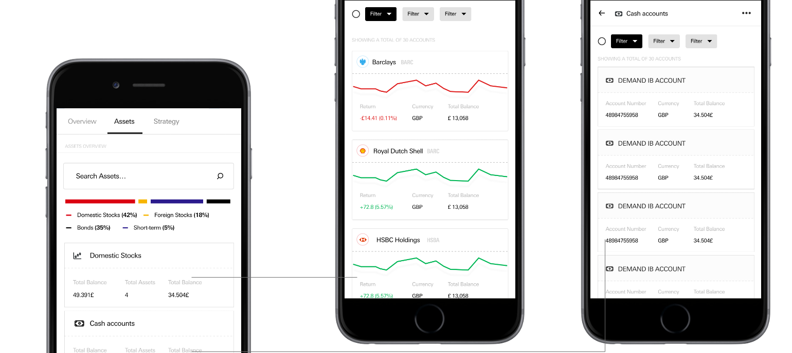

# The Problem

### This is a University project / assignment

HSBC Private Banking Digital serves more than 50,000 clients globally across 67 countries and has realized their customer base is getting younger but third technology strategy and applications are getting older. Traditional clients rely on relationship managers and investment consultants, which often are in charge of the required software to manage and oversee their portfolios. Younger customers, however, which are inheriting wealth directly from traditional customers, are a key focus as the private banking sector is getting more competitive.

The app concept proposed in this project is a redesign and reconceptualization of the current HSBC Private Banking app, which expands its functionality and core elements to target the profiles and expectations of Highly Net Worth individuals, with more tailored offerings. 

# Topic Research

The private banking market is highly dynamic and competitive, with new competitors trying to successfully use innovative technologies to retain existing clients and add new ones who want a tailored experience.

*   Apps should be central elements in providing exclusive services to premium customers, with key features such as:
*   **Security and privacy**: Two-step authentication, biometric login, thumbprint recognition, data encryption and fraud protection.
*   **Innovation**: Chatbots, voice-controlled features, hands-free interactions, etc.
*   **Reliability**: Portfolio overview, personalization, trading options, brokerage, foreign exchange transactions.
*   **Interactivity**: Live chat between bankers and customers, video conferencing.
*   **Personalization**: Notifications, service offerings, tailored market and economic research, educational content…

Sketching out the first user requirements and working on low-fidelity interfaces.

Features list, user journeys and high-fidelity interfaces are created.

`Dashboard`

As the app concept focuses on value-added features for the user, a dashboard screen was required where they could access the most important updates/notifications of all these features in one screen.

`Value-added services`

This proposed app concept offers value-added features in
addition to core functionality, to offer its users a more complete experience that will keep old customers and attract new ones. The idea is to create an open “ecosystem” where the user feels in control and customise their experience.

`API ecosystem`

This app concept proposes a tool marketplace for its users where they can download third-party and HSBC-created tools that would make their experience more customisable. 

`Design: Portfolio overview (Asset options)`

Users can manage, add and remove assets from their portfolios. Assets are divided in different categories and are attached to an asset allocation strategy.

