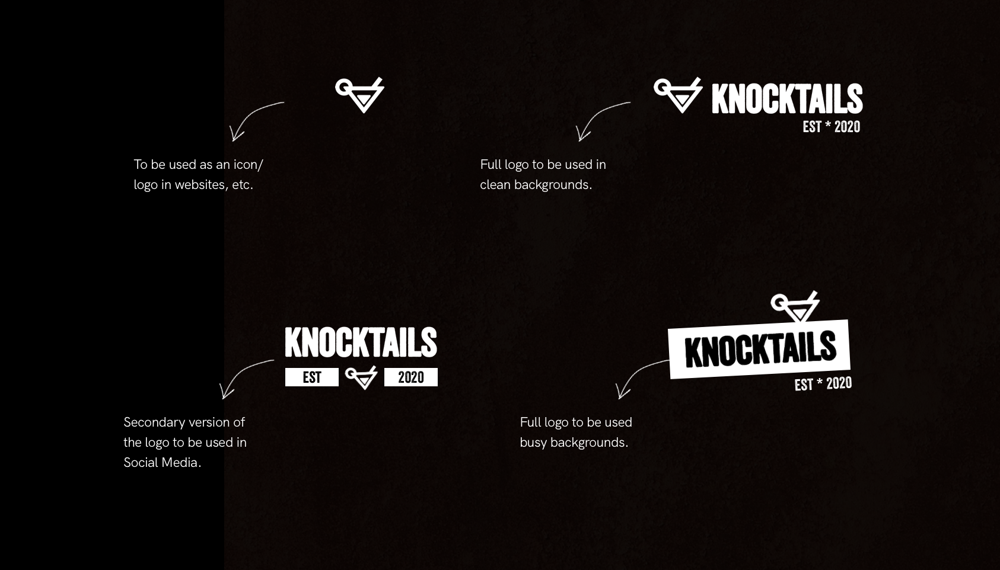
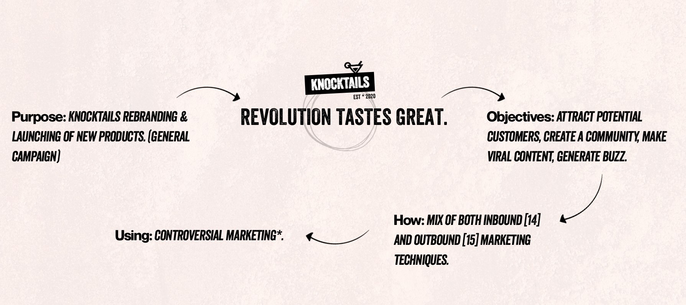
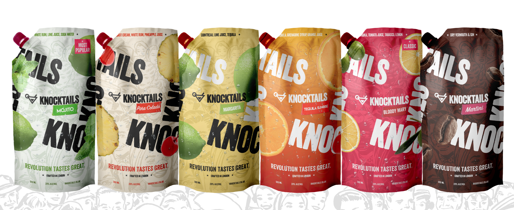
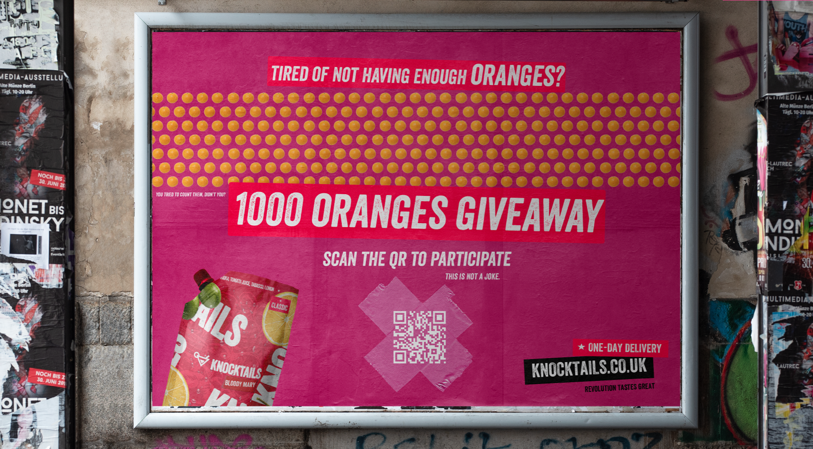
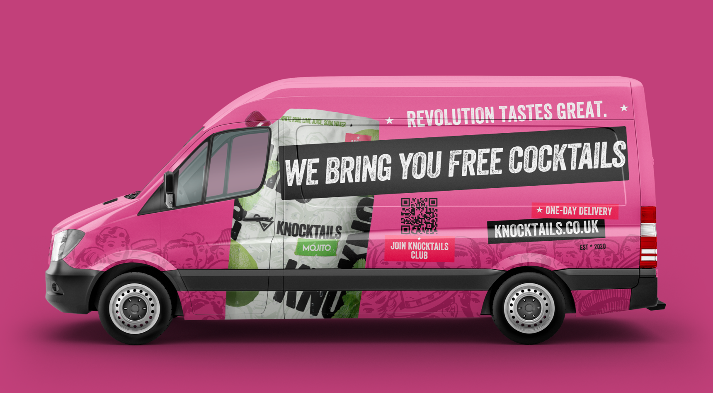
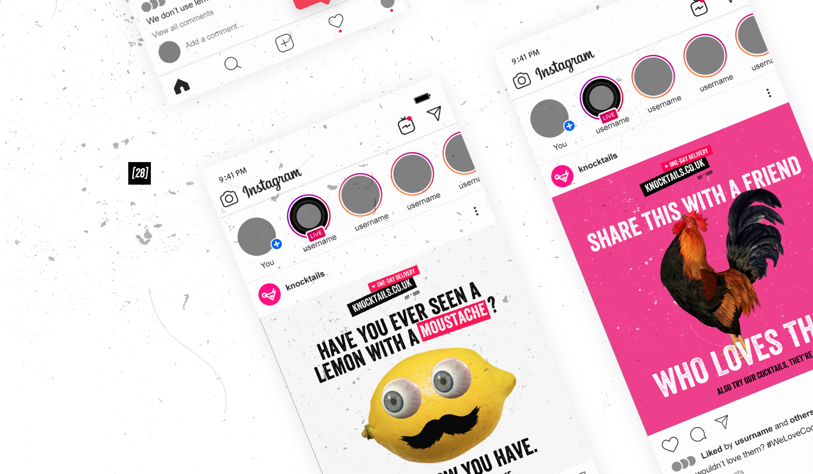
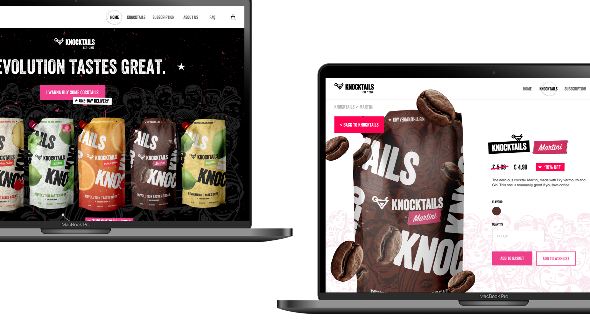

# The Problem

### This is a University project / assignment

Knocktails is a real-life London-based small online business which crafts and delivers bar-quality cocktails to the customers’ door.

This project aims to explore a , through both inbound and outbound marketing techniques. 

This project focuses on visual implementation of several marketing concepts and ideas, as well as setting Knocktails’ new brand guidelines.

KNOCKTAILS’ central promise is to and redefine the cocktail-drinking culture by delivering amazing bar-quality cocktails to the customer’s door, and create a community of  people who want to have fun.

Knocktails is born to be wild and targets rebel customers who really appreciate the unconventional and reject the status quo. Knocktails sets a new attitude and is determined to show their customers it is not right to be a sheep in society. 

Knocktails fits within the rebel brand archetype and wants to be brave, quickly adaptable to change and position the brand as a powerful alternative to the mainstream. Knocktails wants to stand out and attract new customers by bringing new perspectives and changes.

Knocktails logo has been designed to help the potential customer visualize what the brand is all about. The logo is simple, yet bold and strong. There are four total versions of the Knocktail’s logo. All four versions have been designed to work in several visual scenarios, no matter the background color. 

