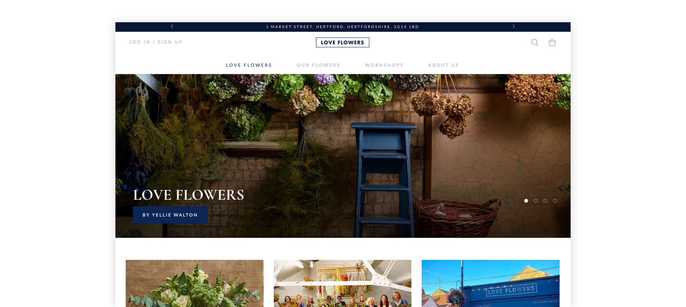
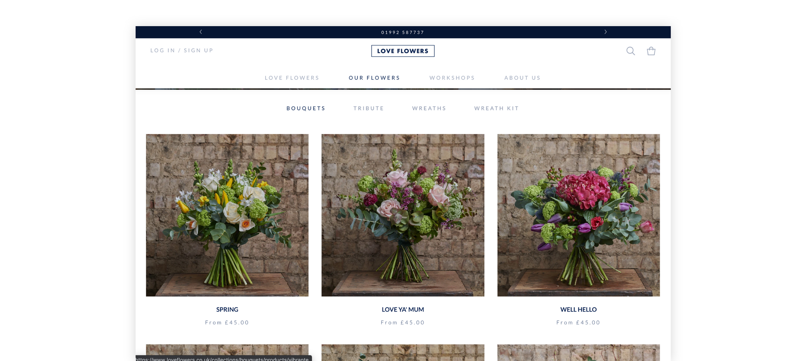

Karmoon is a Shopify web development agency (eCommerce) with over 5 years of experience working for the world’s best Shopify stores. During my second year of university, I got hired at Karmoon as a junior front-end developer.

During my time at Karmoon, I fully developed the Love Flowers e-commerce site.

In order to pull dynamic data I used Liquid, an open-source template language created by Shopify and written in Ruby. It is the backbone of Shopify themes and is used to load dynamic content on storefronts. Liquid has been in production use at Shopify since 2006 and is now used by many other hosted web applications.

You can check out the final production site here.

