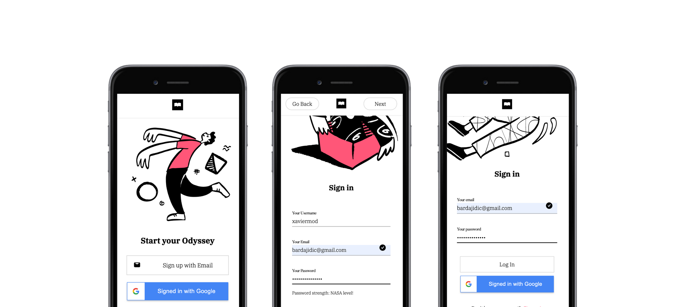
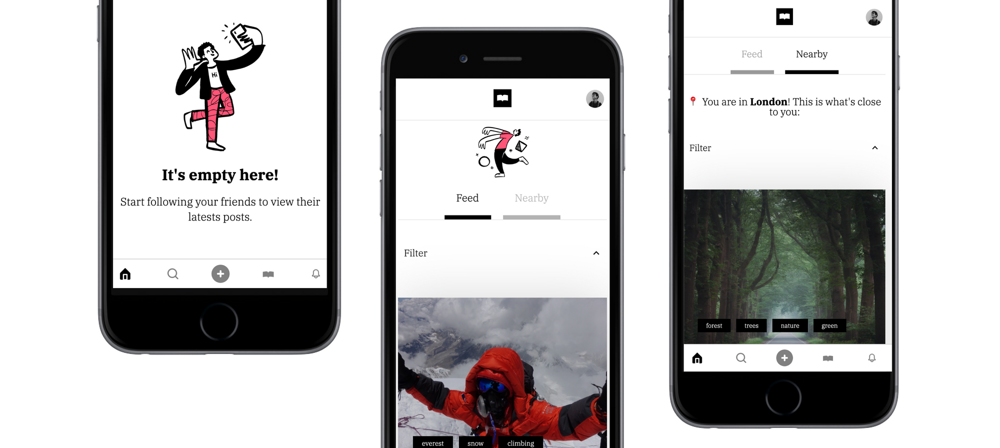
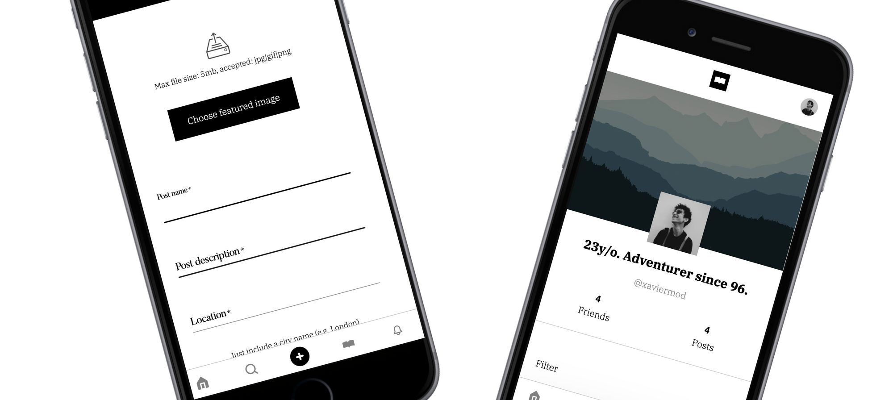
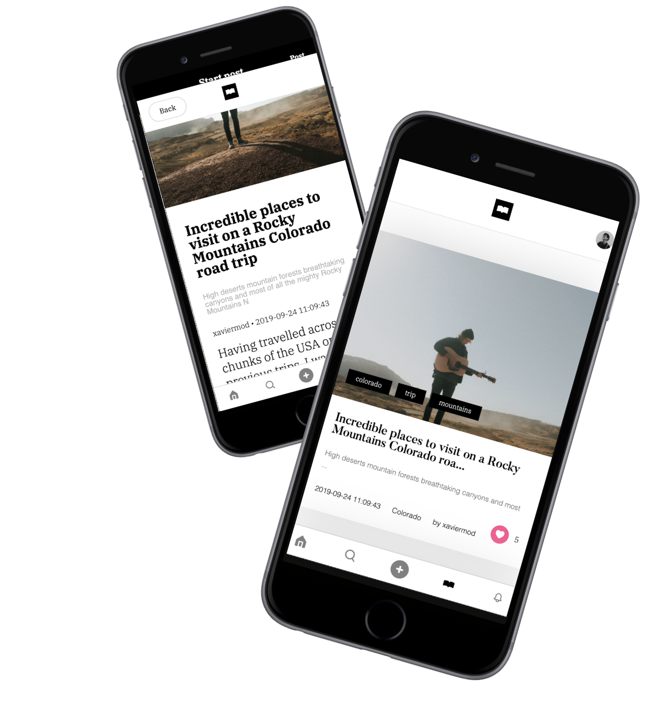
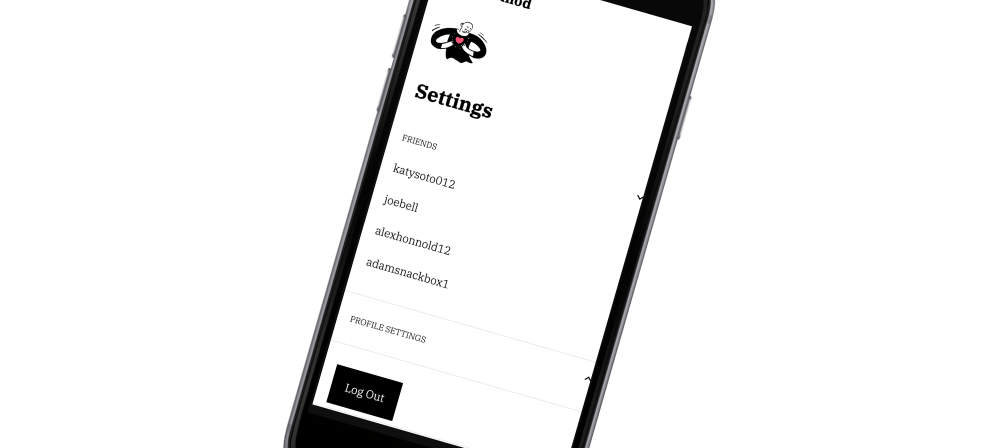

Odyssey is a web full-stack social media application for adventurers, travelers... who want to share their most exciting adventures with their friends or the world. This is a University assignment for both server-side and mobile web development modules, so it is not meant to be a fully functional application and has only been developed to showcase my development skills.

As for the client-side, it has been developed using one of the most used front-end frameworks instead of using plain JS. As for the back-end, I have applied essential web development concepts such as AJAX, PHP Forms, JSON as a data transfer method, and local storage.

I have decided to build Odyssey as a Single Page Application (SPA) for several reasons. SPAs do not update the entire page, only the required content and therefore they significantly improve a website’s speed. Catching local data is more effective as the SPA only sends one request to the server to load the main page and store all the data it receives. Furthermore, SPAs have a significant impact on user experience as it provides simple linear visual experiences that feel like a native application.

Odyssey has been structured, designed, and built with a twofold goal: On one hand, to meets all base requirements of the assignment. On the other hand, to expand its required complexity incorporating new features and functionality to build a fully functional Social Media application. All pages of the platform have been designed and implemented considering responsiveness, adjusting its content from desktop computers to mobile devices, focusing primarily on mobile devices.

The home feed includes a block of posts that renders dynamically, depending on the user’s friends. A very simple algorithm has been implemented, taking two posts of each user friend and showing them to the user.

Users can create a post and add it to their database, which then will be accessible to be seen by other users. (see feature: Visual post creation and implementation.)

All user profiles and posts are rendered in different routes which can then be accessed for different parts of the app.

Posts are the main element of the application. Instead of having “photographers” that share pictures, Odyssey has users that share posts on their profiles (including images and other information). Moreover, posts have their own dynamically generated routes so they can be used throughout the platform.

A settings menu that can be accessed from anywhere within the app. It shows different options that can be customized by the main user. Users can follow other users within the platform. These friends are can be accessed from the settings page. Users can also edit some information about their profile: profile image, cover image, and profile title.

## Form design and library system

Following React’s principle on reusability, I have coded several core components that are used within the app. For instance, all form elements are based form a single component on the “Library” folder and have different parameters or props to use them in different scenarios.

Regarding forms and user input, two major factors have been taken into account when designing and implementing them: perception of complexity and interaction cost. The first thing users do when they see a new form is to estimate how much time is required to complete it. Therefore, perception plays a significant role in this estimation process. On the other hand, interaction cost, the sum of efforts that users put into interacting with an interface, needed to be low (by creating simple and readable forms).The more effort users have to make to complete a form, the less usable it becomes.

All fields have labels for proper identification, have field auto-focusing, do not follow bad practices such as information repetition, and don’t slice data fields. Placeholders and masked inputs are widely used throughout the app and they all provide matching keyboard capabilities.

One of the key aspects of Odyssey’s experience is signing up / login into the platform. The platform’s routes cannot be accessed if the user has not successfully registered. A versatile input validation system has been implemented, with client-side email and password validation (with a strength indicator).

Moreover, the front-end also handles all possible user errors by displaying messages when an email address or the username has already been taken. Once the user has successfully met all validation criteria, the next button becomes active and moves the user to the homepage.

Please be aware that the Google implementation in this section has only been implemented on the Front End and communicates with neither the back end nor the database.

## Home Feed based on friend’s recent activity.

The home feed is populated with the active user’s friends posts, with a limit of 2 per friend. As with all other types of posts preview render, these can be filtered.
If the user has a total of 6 friends, the home feed would show 12 total posts (2 recent posts per friend). Although this implementation does have a medium level of complexity when it comes to SQL dynamic querying, it could not be considered a complex algorithm. Other successful social media applications have very complex algorithms based on machine learning and Artificial Intelligence to show the user feed based on their preferences.

## Home Nearby Feed based on the user’s coordinates.

Using the Geolocation API, Odyssey gets the user’s coordinates (required authorization) and these are then transformed into city locations using the LocationIQ service.

Google’s Location API was free until 2018 when they implemented a token pay-per-use system. To use Google’s API a payment method needs to be introduced and I did not consider this action being worth it for a University assignment. Instead, I used a much better independent approach using the LocationIQ free service, while using the core JavaScript Geolocation API to get the user’s coordinates.

This feature, however, can only be accessed using Google Chrome, as Safari does not support the library since 2017.

Front-End based flexible, reusable and scalable filtering system for posts rendering.

One of the most complex components of Odyssey is its filtering system. Due to React’s system of reusable components, the posts filter can be accessed anywhere on the app where there are posts to show. This filter is also based on a multivalue search. The results sorted by the filter can have several options at the same time: dates, location, and custom tags based on user input.

Furthermore, this filter is client-side based. When filtering through options, the client is not requesting any new information, just re-rendering the posts component with a different order.

## Templates rendering system for profiles and posts.

All posts and profiles have an entry on the database. Based on these entries, Odyssey provides individual posts and profiles routes that can be accessed from everywhere within the app. This dynamic method allows for a high level of flexibility and reusability.

A single AXIOS call to the server gets all posts and profiles from the database and then loops through different routes to renter profile and posts templates with an associated route.

## Like System on posts.

All posts can be liked by any user and their like count is attached to their database entry. A list of which posts have a user liked is also stored in the user’s database entry, making the function dynamic and reusable for the logged-in user.

