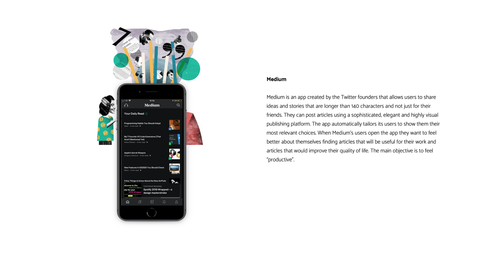
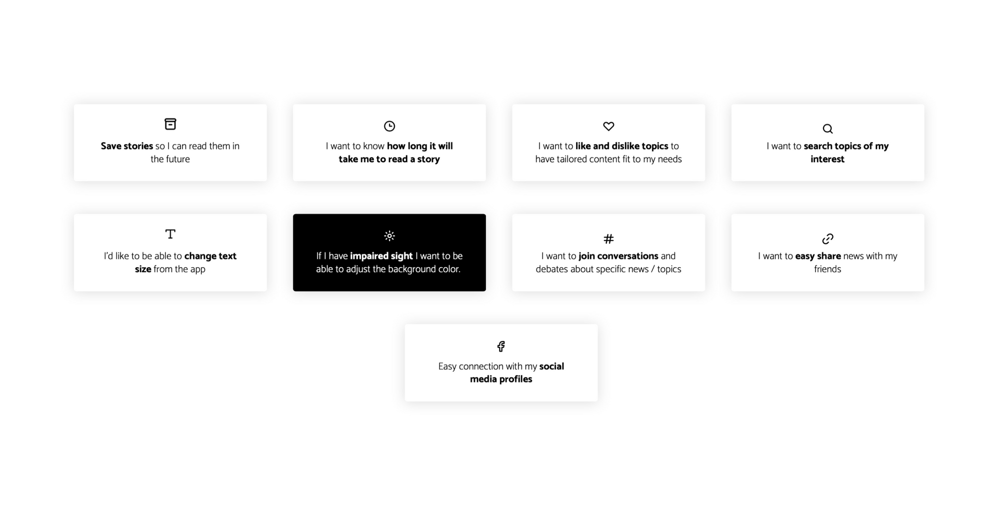
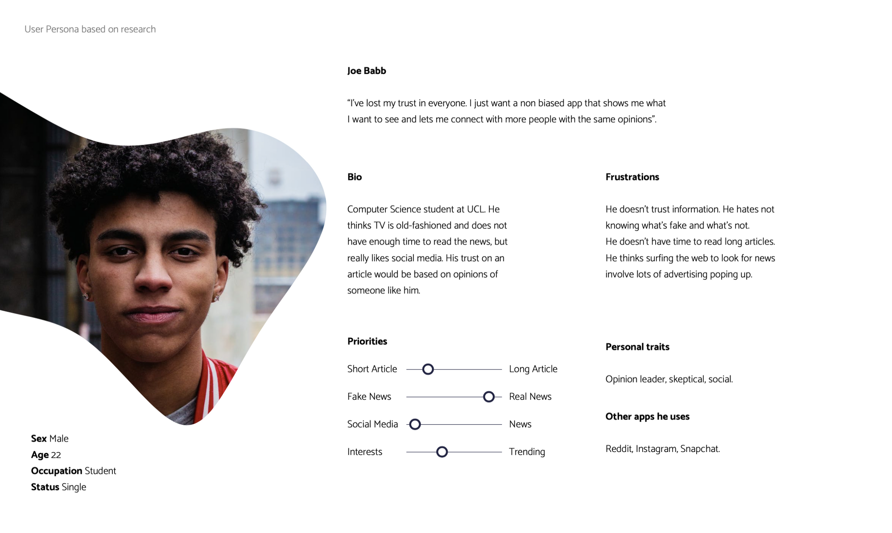
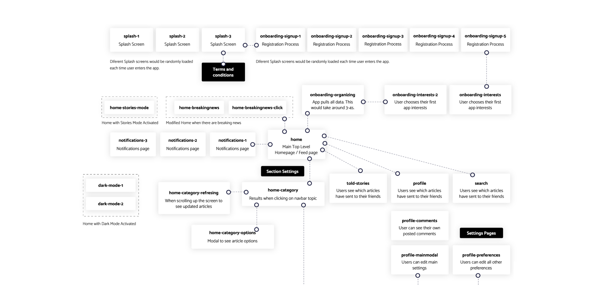
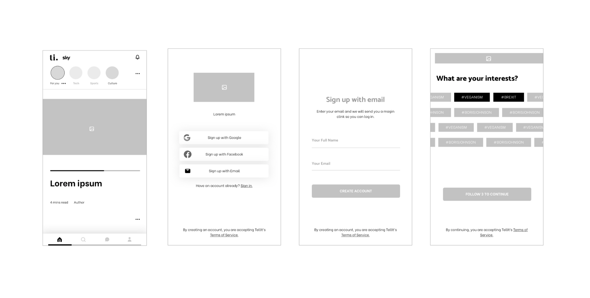
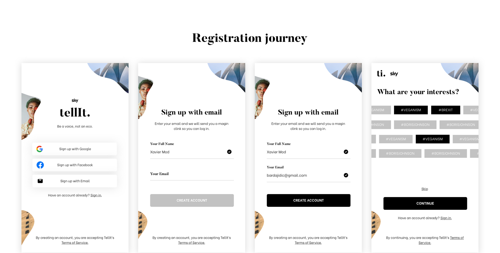
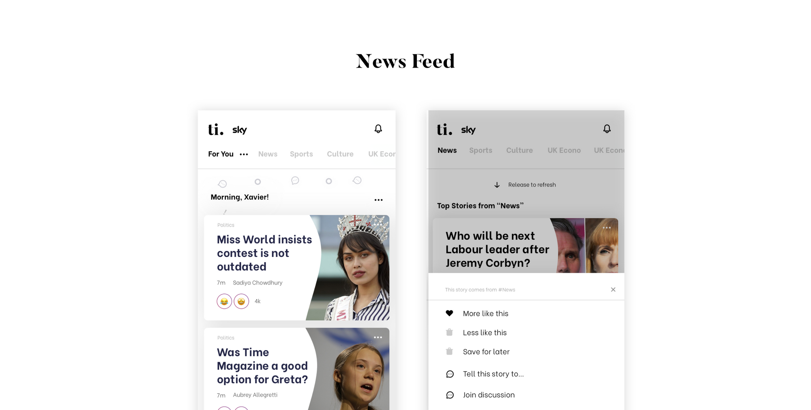
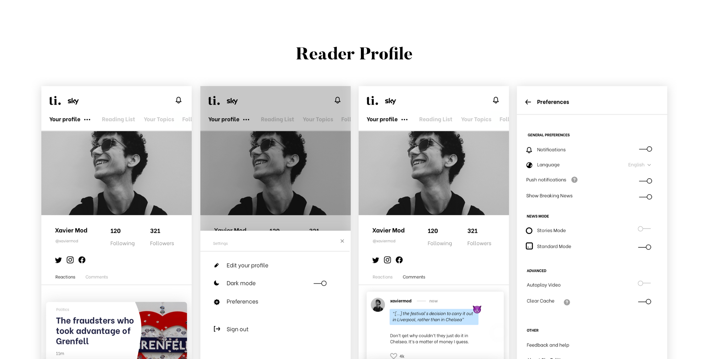
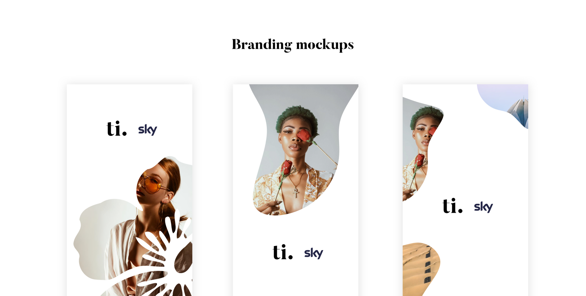

Tell It is a news app targeted to a younger demographic. As part of one of our 2nd-year University modules, we were told to design and prototype this project. 

# App objectives

*   To design a mobile app delivering the news to a younger demographic (ages 18-25)
*   Consider a breaking news day on the designs. 3. How the app would look like on a standard news day.

# User target

80% of the online market consumes content on a mobile. The user is digitally native and savvy, being the highest users of mobile for the longest periods of time.

# App considerations

*   News Brand, Top Stories, Video, Categories, Interactions, Social, shareability, gamification. 2. Include an article from these categories: UK, Politics, US, Science & Tech, and Ents & Arts.

# Initial Research on Millennials and Generation Z’s (M&Z).

Millennials were born between 1983 and 1994, while Gen Z’s were born from 1995 to 2002. When doing studies and research on these two types, the answers provided are often remarkably similar.

M&Z’s believe their ambitions are within reach and have strongly evolved since past generations. Most of them want to travel the world, earn high salaries, buy homes of their own, make positive impacts on society, and start families. Moreover, there has been a deterioration of optimism towards their macroeconomic environments. M&Z’s are worried about climate change, income inequality, unemployment, personal safety, political instability, and terrorism.

In regards to how they establish last-longing relationships with companies, societal impact and ethics are within the most common reasons. They will trust a company that has products/services which positively impact society. They also focus on its ethical behavior, ability to protect data, online tracking, and its position on political matters.

In conclusion, M&Z’s want companies to become meaningful, and to serve as agents for positive change. They expect these businesses to enhance lives and provide livelihoods, but they don’t see enough businesses filling the void. It is essential to create an app that listens to these new younger generations that inspire loyalty to them.

# Competitor analysis

Medium served as a primary source of inspiration to design Tell It. 

List of Tell It's goals. 

I used UX personas to create Tell It with a specific target user in mind rather than a generic one. Personas are a representation of the real target audience data, gathered in previous research such as user interviews.

I also provided a navigation system to show how the total number of UI screens interact with each other.

I also used wireframes to layout content and functionality. Wireframes are used early in the development process to establish the basic structure of a page before visual design and content are added.

**🔥 Final UI Designs**

## Registration Journey

When opening the app, users would land on a registration form. This form has been designed using the latest standards for registration journeys. Users would be able to sign up using their social media or email. Signing in via social media would include third-party integration. If they decide to use their email, only a “magic link” would be used to access the app. No passwords. For first time users, the registration journey would include an "interests" page that gathers their interests to pull data on the home page

## Feed

The home page or feed would be the main top-level tab of the app. One of the main components across the app is the Topics Nav Bar, which would be used across several pages to always have the content organized within their own categories. Down below this navbar, a carousel with articles would be displayed to the user.

The feed page would be personalized for each user (allowing them to select which categories they would like to see). Moreover, content would be tailored depending on which type of articles they spend most of their time in.

Users would be able to use carousels to navigate through their articles. There would also be a “join the debate” section where they could join hot debates on different articles similar to the ones they read. Articles modules would have an individual preference modal with different options for the user.

## User profile

The feed page would also be displayed differently depending on the user’s preferences. A story mode could be activated to simplify the experience on the homepage. News would as stories and when the user clicks on them they would link to an article. Moreover, a notifications system would be added and it would be available throughout the app. 

Users would see new stories/articles and comment responses. Finally, the homepage would have a “breaking news” module (could be managed from preferences) where breaking news would be displayed.

## Branding

The key elements of the style guide of the app are colors. visual language, fonts, logo variations, and components.

After some consideration, the main colors chosen for tellIt were very simple: black and white. Following this minimalistic approach, the user would get focused on the articles, images, and discussions rather than being distracted by colors. Furthermore, instead of using a pattern of symbols as a visual language, images would be the fundamental part of the aesthetics of the app. These images should always be used with creative random shapes that make the user feel in a very creative, fresh, and modern environment. Also, images need to be always chosen carefully. A key principle in the app itself would be great articles, and those need to be using great images.

The fonts chosen for the project are Butler and Be Vietnam. On one hand, Butler is classy, elegant, and trustworthy. It gives a sense of professionalism and security where the user feels confident. On the other hand, Be Vietnam is modern and fresh..

The name chosen for the app is tellIt (Tell It), and it focuses on the core purpose of the app: to tell stories. The slogan chosen is “Be a voice, not an eco”, and this is a direct message to Tell It's users: they need to stand out as opinion leaders.